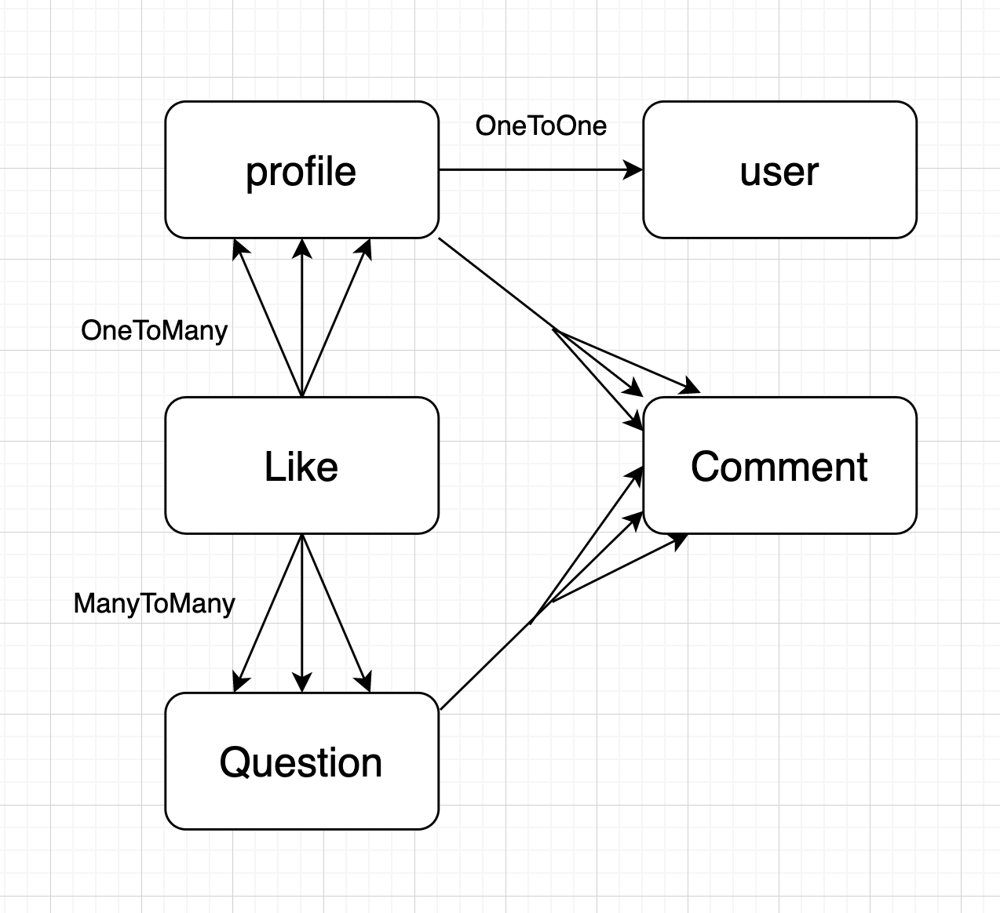

# ASK-app

This application is hosted on [Heroku](https://djangoaskapp.herokuapp.com/) 


## Project description

ASK is an application build on Django that allows users to receive answers to their questions. MVP is to create a web application that users can read questions and answers of other users, but can ask questions and add their answers only after registration and login.


## Technologies

- Python
- Django
- HTML
- CSS
- Bootstrap
- AWS S3 bucket for image upload

## Installation steps

**After clonning run following command**
```
pip install -r requirements.txt
```

**Set Database (Make Sure you are in directory same as manage.py)**
```
python manage.py makemigrations
python manage.py migrate
```

**Create SuperUser**
```
python manage.py createsuperuser
```

Also you may need S3 bucket on AWS for image upload feature. 
Hide your *Secret keys* in .bash_profile
```
export AWS_ACCESS_KEY_ID ="your key id"
export AWS_SECRET_ACCESS_KEY="your secret key"
export AWS_STORAGE_BUCKET_NAME="your bucket name"
```

## User stories

ASK app users are smart people who always seek knowledge and love to share their thoughts and experience. 

- As a user, I’m able to register for the web application.
- As a user, I’m able to log in to the web application.
- As a user, I’m able to log out of the web application.
- As a user, I’m able to update my account from the web application.
- As a user, I’m able to read other users questions and comments
- As logged in user, I’m able to post a question
- As logged in user, I’m able to leave an answer to the questions as a comment
- As logged in user, I’m able to delete my comments
- As logged in user, I’m able to edit my comments

## Wireframes

Wireframes for this application you can find [here](https://xd.adobe.com/view/b66643d1-23e2-4097-8766-f687c2cd3acd-e335/)

## Entity relationship diagrams



## Future features

- Password reset
- Likes and dislikes for answers section
- Categorize questions by topics
